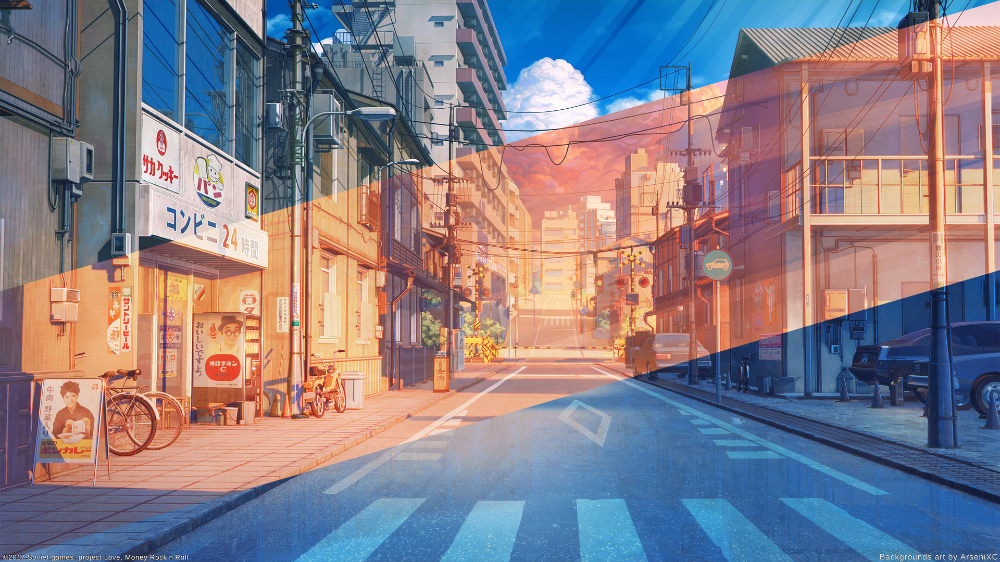

# TokyoStreet-Dynamic-Wallpaper

You can download the animated wallpaper [here](tokioStreet.avif)
Original Size: **1920x1080**

In order to use this, you need KDE Plasma and Plasma dynamic wallpapers plugin by zzag. You can download and install the plugin from [plasma5-wallpapers-dynamic](https://github.com/zzag/plasma5-wallpapers-dynamic)

This beautiful artwork is designed by arsenixc.  
[ArtStation Page](https://www.artstation.com/arsenixc)

